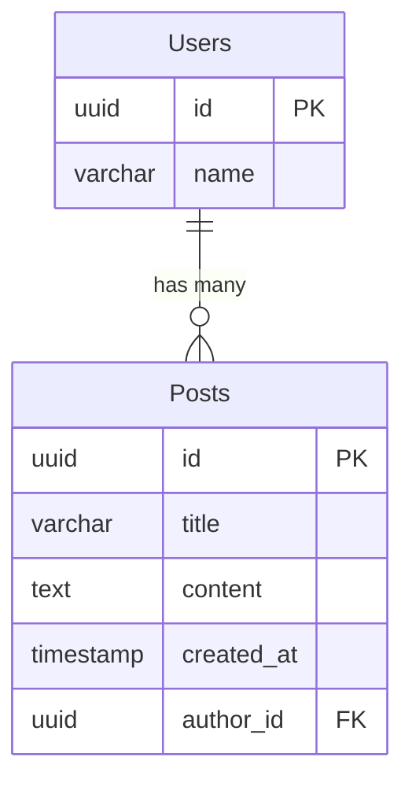

# Different ORMs API

[](https://www.typescriptlang.org/)
[](https://expressjs.com/)
[](https://www.postgresql.org/)
[](https://docs.docker.com/compose/)
[](./LICENSE)

> The same REST API built 5 different ways. Comparing **Prisma**, **Drizzle**, **TypeORM**, **Knex**, and **Sequelize** side-by-side with Express + TypeScript + PostgreSQL.

Each implementation exposes identical endpoints with the same `Users` and `Posts` data model, so you can directly compare how each ORM handles schema definition, migrations, queries, and relations.

## ORM Comparison

| Feature | Prisma | Drizzle | TypeORM | Knex | Sequelize |
|---|---|---|---|---|---|
| **Type Safety** | Full (generated client) | Full (schema-first) | Decorators + TS | Manual typing | Manual typing |
| **Schema Definition** | `.prisma` DSL | TypeScript tables | TypeScript decorators | Migration-only | Class + `init()` |
| **Query Style** | Fluent API | SQL-like builder | Repository / Active Record | Raw SQL builder | Active Record |
| **Migrations** | Auto-generated | Auto-generated | CLI + manual SQL | CLI + manual | CLI + manual |
| **Relations** | Declarative in schema | Separate `relations()` | Decorators | Manual JOINs | `hasMany` / `belongsTo` |
| **Learning Curve** | Low | Medium | Medium | Low (SQL knowledge) | Medium |

## Project Structure

```
different-orms-api/
├── docker-compose.yml          # PostgreSQL + Adminer
├── api-with-prisma/            # Prisma ORM implementation
├── api-with-drizzle/           # Drizzle ORM implementation
├── api-with-typeorm/           # TypeORM implementation
├── api-with-knex/              # Knex query builder implementation
├── api-with-sequelize/         # Sequelize ORM implementation
├── pnpm-workspace.yaml
└── package.json
```

Each subproject follows the same structure:

```
api-with-*/
├── src/
│   ├── index.ts                # Express app entry point
│   ├── routes/                 # Route definitions
│   │   ├── posts.ts
│   │   └── users.ts
│   └── controllers/            # Request handlers (ORM-specific)
│       ├── posts.ts
│       └── users.ts
├── package.json
├── tsconfig.json
└── .env.example
```

## ERD (Entity Relationship Diagram)



## Quick Start

### Prerequisites

- [Docker](https://docs.docker.com/get-docker/) (for PostgreSQL)
- [pnpm](https://pnpm.io/installation) (package manager)

### 1. Start the database

```bash
docker compose up -d
```

This starts PostgreSQL 18 on port `6500` and Adminer (DB GUI) on port `8080`.

If you still have a Docker volume from an older compose file that mounted PostgreSQL data at `/var/lib/postgresql/data`, remove it once so the container can initialize the layout expected by PostgreSQL 18: `docker compose down -v`, then `docker compose up -d` again (this deletes local DB data in that volume).

### 2. Pick an ORM and install

```bash
cd api-with-prisma    # or any other api-with-* folder
cp .env.example .env
pnpm install
```

### 3. Run migrations and start the server

```bash
# For Prisma:
pnpm migrate:up && pnpm dev

# For Drizzle:
pnpm migrate && pnpm dev

# For TypeORM:
pnpm migration && pnpm dev

# For Knex:
pnpm migrate && pnpm dev

# For Sequelize:
pnpm migrate && pnpm dev
```

The API will be available at `http://localhost:3000`.

## API Endpoints

All implementations expose the same endpoints:

| Method | Endpoint | Description | Request Body |
|---|---|---|---|
| `GET` | `/api/posts` | Get all posts | -- |
| `GET` | `/api/posts/:id` | Get a single post | -- |
| `POST` | `/api/posts` | Create a post | `{ title, content, author_id }` |
| `PATCH` | `/api/posts/:id` | Update a post | `{ title, content }` |
| `DELETE` | `/api/posts/:id` | Delete a post | -- |
| `GET` | `/api/users/:id/posts` | Get a user's posts | -- |
| `POST` | `/api/users` | Create a user | `{ name }` |

## Tech Stack

- **Runtime:** Node.js
- **Framework:** Express 4.18
- **Language:** TypeScript 5.4
- **Database:** PostgreSQL 18 (via Docker)
- **Package Manager:** pnpm
- **DB Admin:** Adminer (included in Docker Compose)

## Docker Services

| Service | Port | Credentials |
|---|---|---|
| PostgreSQL | `6500` | user: `root`, password: `example`, db: `example_database` |
| Adminer | `8080` | (use PostgreSQL credentials to log in) |

## License

This project is licensed under the MIT License -- see the [LICENSE](./LICENSE) file.
